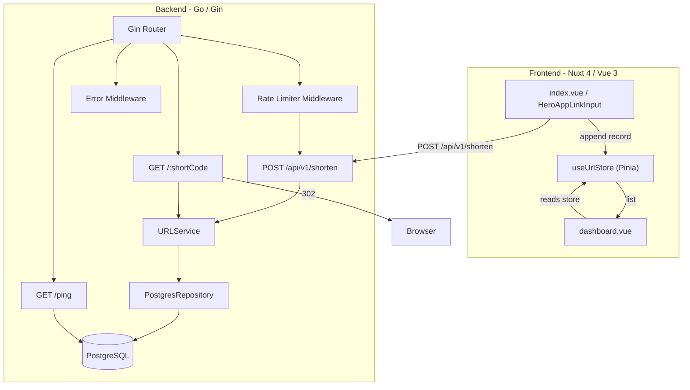

# Design Document

## URL Shortener Phase 1

---

## Overview

SwiftLink is a URL shortening service with a Go/Gin backend and a Nuxt 4 / Vue 3 frontend. Phase 1 brings the existing working prototype to a production-ready state by addressing known bugs, hardening the backend, and completing the frontend feature set.

The changes fall into two categories:

1. **Backend hardening** — URL validation at the service layer, cryptographically-random short-code generation, collision retry logic, a bug fix for the redirect SELECT query, rate limiting on the shorten endpoint, and an improved health check.
2. **Frontend completion** — proper error handling in the Link_Input component, a Pinia URL store, and a `/dashboard` page.

No new external services are introduced. The existing PostgreSQL schema, Gin router, and Nuxt module set are sufficient for all Phase 1 requirements.

---

## Architecture



The frontend runs locally via `pnpm dev` and communicates with the backend via the `BACKEND_API_BASE_URL` runtime environment variable. The backend connects to PostgreSQL via `DATABASE_URL`.

---

## Components and Interfaces

### Backend

#### URLService (service layer)

The service layer is the single point of URL validation and short-code generation. All validation must live here so it applies regardless of transport.

```go
type Service interface {
    CreateShortURL(ctx context.Context, req *model.CreateURLRequest) (*model.CreateURLResponse, error)
    GetOriginalURL(ctx context.Context, shortCode string) (string, error)
}
```

**Changes from current implementation:**

- `CreateShortURL` validates `req.OriginalURL` using `net/url.Parse` — scheme must be `http` or `https`, host must be non-empty.
- Short-code generation switches from `math/rand` to `crypto/rand`.
- Collision retry loop: attempt insert up to 5 times; on a unique-constraint violation, generate a new code and retry; after 5 failures return a 500 error.

#### URLRepository (data layer)

```go
type URLRepository interface {
    CreateShortURL(ctx context.Context, req *model.URL) error
    GetURLByShortCode(ctx context.Context, shortCode string) (*model.URL, error)
    IncrementClick(ctx context.Context, id int64) error
}
```

**Bug fix:** `GetURLByShortCode` SELECT query adds `short_code` to the column list and the corresponding `Scan` call.

```go
// Fixed query
query := `
    SELECT id, original_url, short_code, clicks, created_at
    FROM urls
    WHERE short_code = $1
`
// Fixed Scan
err := r.pool.QueryRow(ctx, query, shortCode).Scan(
    &u.ID, &u.OriginalURL, &u.ShortCode, &u.Clicks, &u.CreatedAt,
)
```

#### Rate Limiter Middleware

A new Gin middleware at `backend/platform/middleware/rate_limiter.go`.

- Uses an in-memory token-bucket or sliding-window counter keyed by client IP (`c.ClientIP()`).
- Limit: 20 requests per minute per IP on `POST /api/v1/shorten`.
- On limit exceeded: returns HTTP 429 with `Retry-After` header and structured JSON error.
- On internal limiter error: logs the error and allows the request to proceed (fail-open).
- Applied only to the shorten route, not to `GET /:shortCode` or `GET /ping`.

Recommended library: [`golang.org/x/time/rate`](https://pkg.go.dev/golang.org/x/time/rate) (already transitively available via `golang.org/x/` dependencies). A `sync.Map` stores one `rate.Limiter` per IP.

```go
type RateLimiterMiddleware struct {
    limiters sync.Map
    rate     rate.Limit  // 20 per minute = rate.Every(3 * time.Second)
    burst    int         // 20
}

func (rl *RateLimiterMiddleware) Handler() gin.HandlerFunc
func (rl *RateLimiterMiddleware) getLimiter(ip string) *rate.Limiter
```

#### Health Check Handler

`GET /ping` is updated to check the database pool:

```go
// Response when DB is healthy
{"status": "ok"}

// Response when DB is unavailable (pool.Ping fails)
{"status": "ok", "db": "unavailable"}
```

Both cases return HTTP 200 — the endpoint signals process liveness, not DB health.

#### Structured Error Responses

The existing `AppError` struct already satisfies the `code` + `message` contract. No structural changes are needed. The `FormatValidationError` function already includes field-level detail. The `ErrorMiddleware` already sets `Content-Type: application/json` via `c.JSON`.

One addition: a `NewConflictError` (HTTP 409) or reuse of `NewInternalError` for exhausted collision retries — `NewInternalError` is sufficient.

A `NewTooManyRequestsError` (HTTP 429) is added to `platform/errors/errors.go`:

```go
func NewTooManyRequestsError(message string, err error) *AppError {
    return NewAppError(http.StatusTooManyRequests, message, err)
}
```

### Frontend

#### useUrlStore (Pinia store)

New file: `frontend/app/stores/useUrlStore.ts`

```typescript
interface UrlRecord {
  id: number
  originalUrl: string
  shortCode: string
  clicks: number
  createdAt: string
}

export const useUrlStore = defineStore('url', () => {
  const urls = ref<UrlRecord[]>([])

  function addUrl(record: UrlRecord): void
  function clearUrls(): void

  const latestUrl = computed<UrlRecord | null>(...)

  return { urls, latestUrl, addUrl, clearUrls }
})
```

The store is session-scoped (in-memory only, no `localStorage` persistence in Phase 1).

#### HeroAppLinkInput (updated)

**Changes from current implementation:**

- `onError` callback replaced with user-visible feedback: calls `toast.add` with the API error message for 400 responses and a generic "Service unavailable" message for 500 / network errors.
- On success: calls `urlStore.addUrl(response.data)` to persist the record in the store.
- Error state is cleared when a new submission begins (`status` transitions to `loading`).
- Removes all `console.log` / `console.error` watch calls (or demotes them to debug-only).

#### Dashboard Page

New file: `frontend/app/pages/dashboard.vue`

- Reads `urlStore.urls` reactively.
- Renders a table/list of URL records with columns: Original URL, Short URL (base + shortCode), Clicks, Created At, Copy button.
- Copy button writes the full short URL to the clipboard and shows a success toast.
- Empty state: message + `<NuxtLink to="/">` link when `urlStore.urls` is empty.
- Added to `AppHeader` navigation.

---

## Data Models

### Backend

No schema changes. The existing `urls` table is sufficient:

```sql
CREATE TABLE IF NOT EXISTS urls (
    id           SERIAL PRIMARY KEY,
    original_url TEXT NOT NULL,
    short_code   VARCHAR(10) NOT NULL,
    clicks       INT DEFAULT 0,
    created_at   TIMESTAMP WITH TIME ZONE DEFAULT NOW()
);

CREATE UNIQUE INDEX IF NOT EXISTS idx_short_code ON urls(short_code);
```

Go model (unchanged):

```go
type URL struct {
    ID          int64     `db:"id"           json:"id"`
    OriginalURL string    `db:"original_url" json:"originalUrl"`
    ShortCode   string    `db:"short_code"   json:"shortCode"`
    Clicks      int64     `db:"clicks"       json:"clicks"`
    CreatedAt   time.Time `db:"created_at"   json:"createdAt"`
}
```

`CreateURLRequest` gains a URL format validator tag:

```go
type CreateURLRequest struct {
    OriginalURL string `json:"originalUrl" binding:"required,url"`
}
```

The `url` binding tag from `go-playground/validator` validates that the value is a well-formed URL. The service layer additionally checks that the scheme is `http` or `https`.

### Frontend

```typescript
// frontend/app/types/url.ts  (new)
export interface UrlRecord {
  id: number
  originalUrl: string
  shortCode: string
  clicks: number
  createdAt: string  // ISO 8601 string from JSON
}
```

---

## Correctness Properties

*A property is a characteristic or behavior that should hold true across all valid executions of a system — essentially, a formal statement about what the system should do. Properties serve as the bridge between human-readable specifications and machine-verifiable correctness guarantees.*

### Property 1: Invalid URL rejection

*For any* string submitted as `originalUrl` that is not a well-formed `http` or `https` URL (including empty strings, non-http/https schemes such as `ftp://`, `javascript:`, `file://`, and strings with no scheme), the URL service SHALL reject the input and return an error without storing any record.

**Validates: Requirements 1.2, 1.3**

---

### Property 2: Valid URL acceptance

*For any* well-formed `http` or `https` URL submitted as `originalUrl`, the URL service SHALL accept the input, create a URL record, and return a response containing the original URL and a non-empty short code of length 6.

**Validates: Requirements 1.4**

---

### Property 3: Short code round-trip

*For any* short code stored in the database, querying the repository by that short code SHALL return a URL record whose `ShortCode` field is equal to the queried short code.

**Validates: Requirements 3.2, 3.3**

---

### Property 4: URL store append

*For any* URL record returned by a successful shorten operation, calling `addUrl` on the URL store SHALL result in that record being present in the store's `urls` list, and the list length SHALL increase by exactly one.

**Validates: Requirements 5.1, 5.2**

---

### Property 5: Dashboard record display

*For any* non-empty list of URL records in the URL store, the Dashboard page SHALL render each record's `originalUrl`, `shortCode`, `clicks`, and `createdAt` fields in the DOM.

**Validates: Requirements 6.2**

---

### Property 6: Rate limit enforcement

*For any* client IP address, after 20 `POST /api/v1/shorten` requests within a 60-second window, the 21st request SHALL receive HTTP 429 with a `Retry-After` header, and all requests beyond the 21st within the same window SHALL also receive HTTP 429.

**Validates: Requirements 7.1**

---

### Property 7: Error response structure

*For any* input to the API that produces an error response, the response body SHALL be parseable as a JSON object containing a `code` field (integer) equal to the HTTP status code and a `message` field (string), and the response SHALL carry `Content-Type: application/json`.

**Validates: Requirements 10.1, 10.3, 10.4**

---

## Error Handling

### Backend

| Scenario | HTTP Status | Error Source |
|---|---|---|
| Missing / empty `originalUrl` | 400 | `go-playground/validator` binding tag |
| Invalid URL format or non-http/https scheme | 400 | Service layer `net/url` check |
| Short code collision (all 5 retries exhausted) | 500 | Service layer after retry loop |
| Short code not found in redirect | 404 | Repository `ErrURLNotFound` |
| Rate limit exceeded | 429 | Rate limiter middleware |
| Rate limiter internal error | — (allow through) | Middleware logs and calls `c.Next()` |
| DB unavailable on `/ping` | 200 (with `db: unavailable`) | Health check handler |
| Unhandled internal errors | 500 | `ErrorMiddleware` fallback |

All errors flow through the existing `ErrorMiddleware` which serialises `AppError` to JSON. The `Content-Type: application/json` header is set by `c.JSON`.

### Frontend

| Scenario | User-facing feedback |
|---|---|
| API returns 400 (invalid URL) | Toast: "Invalid URL. Please enter a valid http or https URL." |
| API returns 429 (rate limited) | Toast: "Too many requests. Please wait before trying again." |
| API returns 500 or network error | Toast: "Service unavailable. Please try again later." |
| Successful shorten | Short URL card displayed; record added to store |
| New submission while error shown | Error cleared before request is sent |

---

## Testing Strategy

### Backend

**Unit tests** (table-driven, using the existing `MockRepo` pattern):

- `url_service_test.go` — extend with:
  - Invalid URL inputs (empty, ftp://, javascript:, plain string) → expect error
  - Valid http/https URLs → expect success with 6-char short code
  - Collision retry: mock repo returns unique-constraint error on first N calls, succeeds on N+1
  - Exhausted retries (mock always fails) → expect error after exactly 5 attempts

- `url_repo_test.go` (new, integration) — requires a test DB or `pgxmock`:
  - `GetURLByShortCode` returns a record with `ShortCode` equal to the queried value

- `rate_limiter_test.go` (new):
  - Single IP: 20 requests succeed, 21st returns 429
  - Different IPs: limits are independent
  - Limiter internal error: request proceeds

**Property-based tests** using [`pgregory.net/rapid`](https://github.com/pgregory/rapid) (pure Go, no external process required):

- **Property 1** — Generate random invalid URL strings (non-http/https schemes, malformed strings, empty strings). For each, call `URLService.CreateShortURL` with a mock repo. Assert error is returned and mock repo `CreateShortURL` was never called.

- **Property 2** — Generate random valid http/https URLs (random hosts, paths, query strings). For each, call `URLService.CreateShortURL` with a mock repo. Assert no error, `ShortCode` length is 6, `OriginalURL` in response equals input.

- **Property 3** — Generate random 6-character alphanumeric short codes. For each, insert via mock repo and call `GetURLByShortCode`. Assert returned `ShortCode` equals the inserted value. (Unit-level with mock; integration test covers the real DB path.)

- **Property 6** — Generate random IP address strings. For each IP, send 21 requests through the rate limiter middleware (using `httptest`). Assert first 20 return non-429, 21st returns 429 with `Retry-After` header.

- **Property 7** — Generate diverse error-producing inputs (invalid URLs, missing fields, non-existent short codes). For each, call the full Gin handler stack via `httptest`. Assert response body is valid JSON with `code` == HTTP status and `message` is a non-empty string, and `Content-Type` header is `application/json`.

Each property test is configured to run a minimum of 100 iterations.

Tag format for each property test:
```
// Feature: url-shortener-phase1, Property N: <property text>
```

### Frontend

**Unit / component tests** using `@nuxt/test-utils` and Vitest:

- `useUrlStore.test.ts` — `addUrl` appends record, `latestUrl` returns most recent, empty initial state.
- `AppLinkInput.test.ts` — mock API returning 400 shows error toast; mock API returning 500 shows generic toast; successful mutation calls `urlStore.addUrl`; error clears on new submission.
- `dashboard.test.ts` — empty store shows empty-state message with home link; populated store renders all record fields; copy button writes to clipboard and shows toast.

**Integration / smoke tests:**

- `/dashboard` route renders without error.
- AppHeader contains a link to `/dashboard`.

### Test Configuration

- Backend: `go test ./...` from `backend/`
- Property tests: `go test -count=1 -run TestProperty ./...`
- Frontend: `pnpm test --run` from `frontend/`
- Minimum 100 iterations per property test (configured via `rapid.Settings{MaxExamples: 100}` or equivalent)
